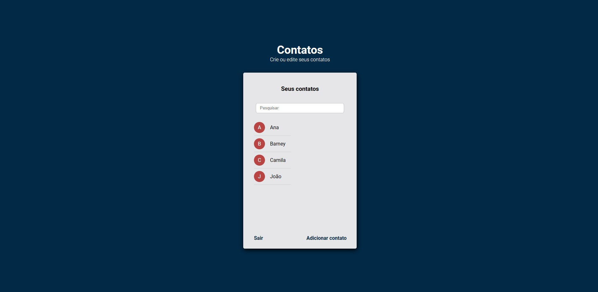
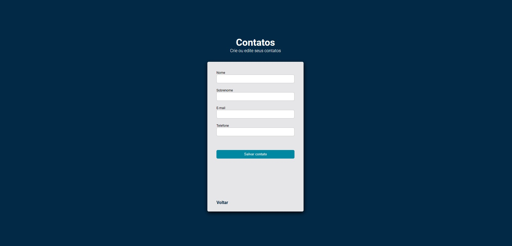

<h1 align="center">
  Agenda
</h1>

  <a href="#-tecnologias">Tecnologias</a>&nbsp;&nbsp;&nbsp;|&nbsp;&nbsp;&nbsp;
  <a href="#-projeto">Projeto</a>&nbsp;&nbsp;&nbsp;|&nbsp;&nbsp;&nbsp;
  <a href="#-link-do-projeto">Link do Projeto</a>&nbsp;&nbsp;&nbsp;|&nbsp;&nbsp;&nbsp;
  <a href="#-licença">Licença</a>

  

 

  

  

  

## ✨ Tecnologias

Projeto em desenvolvimento com as seguintes tecnologias:

- HTML
- CSS
- NodeJs
- Mongoose
- MongoDB

## 💻 Projeto

API de agenda desenvolvida em NodeJs e MongoDB, que permite ao usuário criar um cadastro na agenda para armazenar seus contatos. Os seguintes dados podem ser usado para teste:

login:

#### `teste0@gmail.com`

senha:

#### `123456`

Após o cadastro, o usuário pode fazer login e ter acesso aos seus contatos armazenados na agenda. Além disso, o usuário pode criar novos contatos ou alterar os existentes, de forma simples e intuitiva.

Para hospedar a aplicação, foi utilizado o https://render.com, um serviço de hospedagem em nuvem que oferece alta escalabilidade e desempenho para aplicações web. Com essa solução, a API de agenda pode ser acessada de qualquer lugar, a qualquer hora, garantindo praticidade e eficiência para o usuário.

Aviso: Por usar o plano gratuito do render, o primeiro acesso pode demorar um pouco.

## 🚀 Link do Projeto

https://agenda-nodejs.onrender.com

## 📄 Licença

Esse projeto está sob a licença MIT. Veja o arquivo [LICENSE](LICENSE.md) para mais detalhes.

---

Feito com ♥ by Samuel 👋🏻 [Veja outros projetos!](https://github.com/samuelsilvati?tab=repositories)
