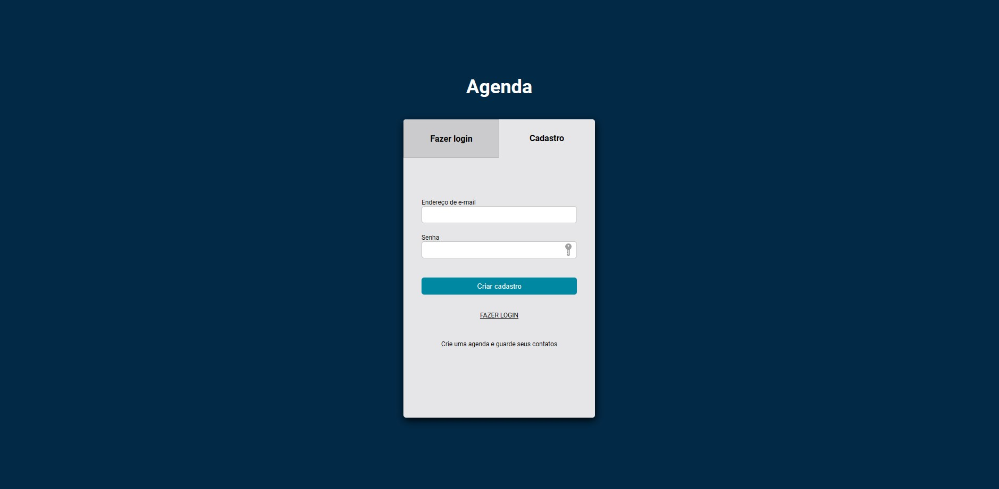

<h1 align="center">
  Agenda
</h1>

  <a href="#-tecnologias">Tecnologias</a>&nbsp;&nbsp;&nbsp;|&nbsp;&nbsp;&nbsp;
  <a href="#-projeto">Projeto</a>&nbsp;&nbsp;&nbsp;|&nbsp;&nbsp;&nbsp;
  <a href="#-link-do-projeto">Link do Projeto</a>&nbsp;&nbsp;&nbsp;|&nbsp;&nbsp;&nbsp;
  <a href="#-licença">Licença</a>

  

 

  

## ✨ Tecnologias

Projeto em desenvolvimento com as seguintes tecnologias:

- HTML
- CSS
- NodeJs
- Mongoose
- MongoDB

## 💻 Projeto

API de agenda desenvolvida em NodeJs e MongoDB. O usuário pode criar um cadastro na agenda, fazer login com os seguintes dados:

#### `teste0@gmail.com`

#### `123456`

Depois de logado, o usuario pode alterar os contatos ou criar novos. 
O deploy do projeto foi feito no https://render.com

## 🚀 Link do Projeto

https://agenda-nodejs.onrender.com

## 📄 Licença

Esse projeto está sob a licença MIT. Veja o arquivo [LICENSE](LICENSE.md) para mais detalhes.

---

Feito com ♥ by Samuel 👋🏻 [Veja outros projetos!](https://github.com/samuelsilvati?tab=repositories)
